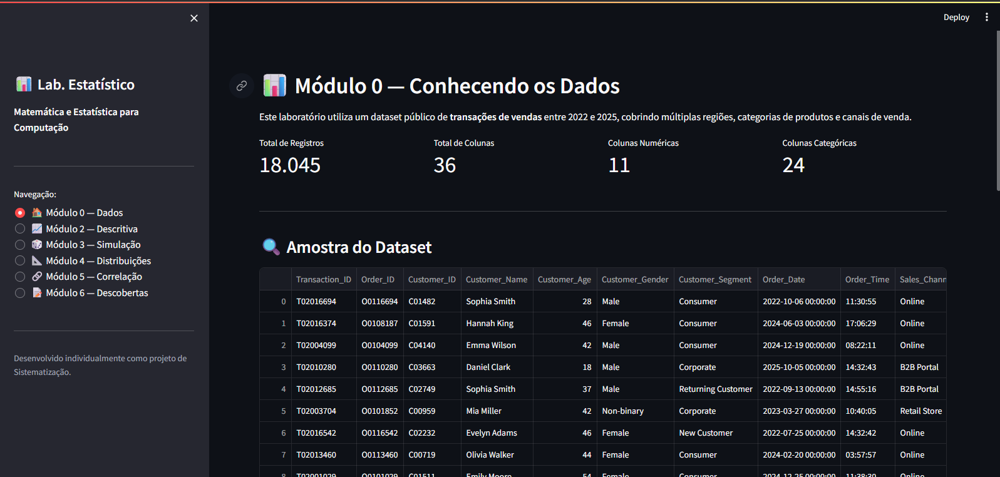
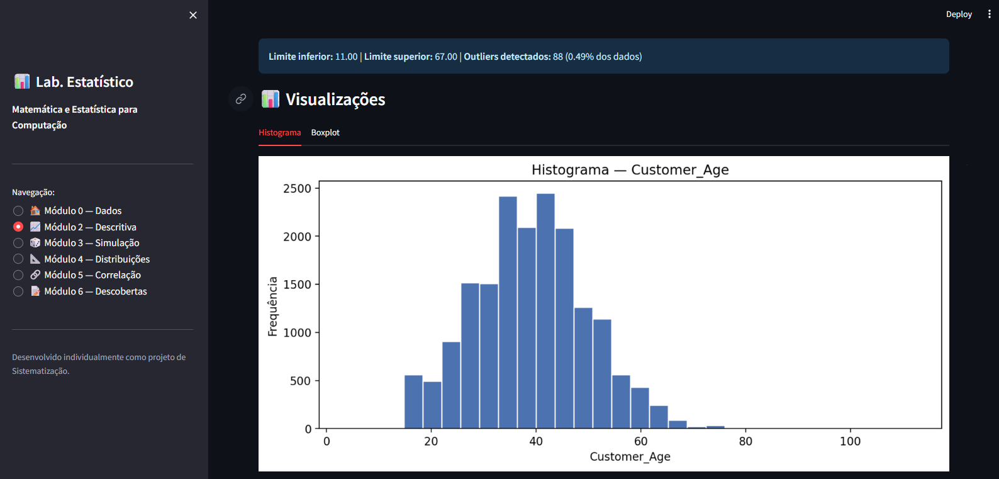
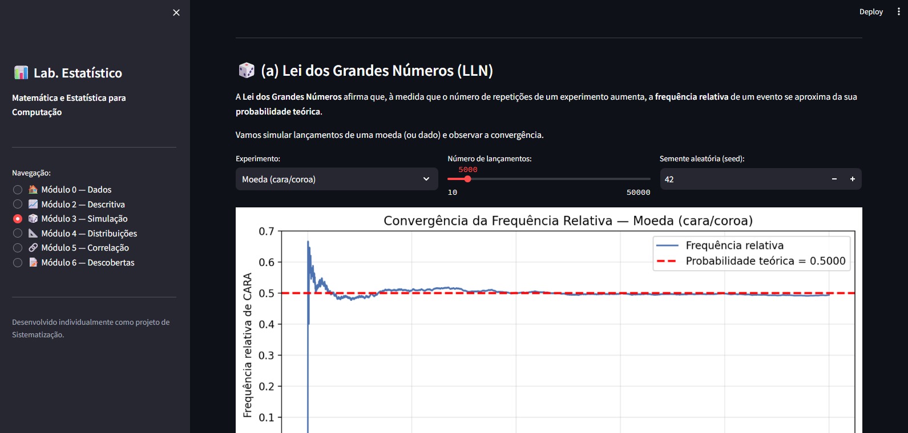
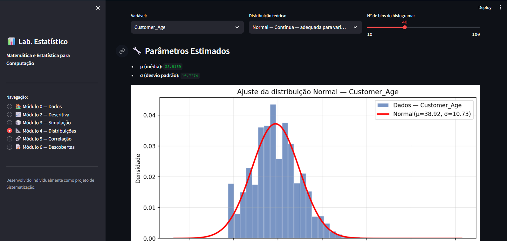
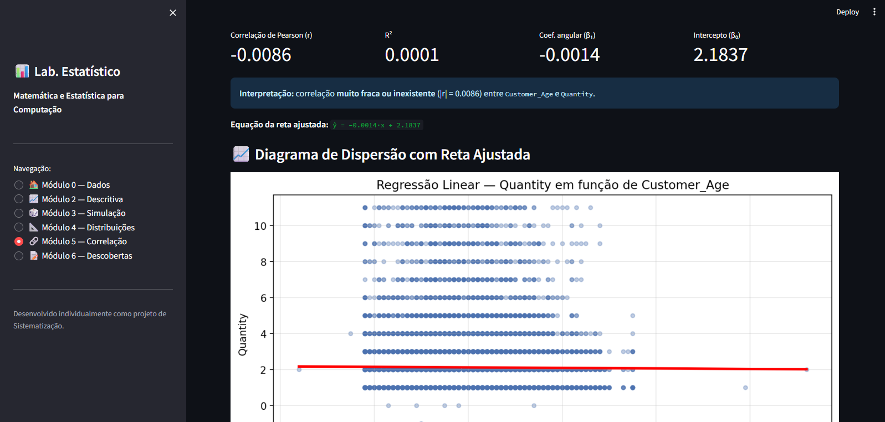
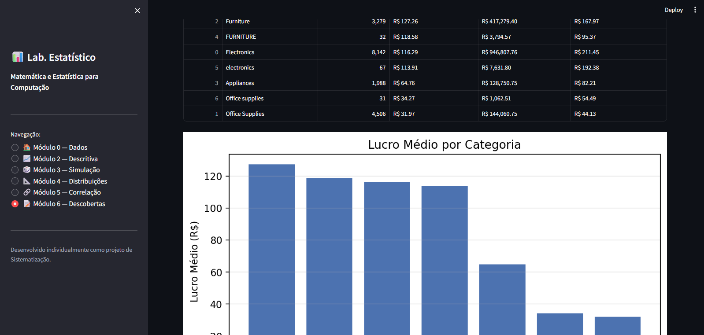

# 📊 Laboratório Estatístico Interativo

Projeto de **Sistematização** da disciplina **Matemática e Estatística para Computação**.

## 👤 Autor

- **Nome completo:** João Vitor de Carvalho Leite
- **Matrícula:** 72650427
- **Turma:** Turma B — Campus Virtual — 20/07/26 GV2

## 🎯 Objetivo

Construir uma aplicação interativa que carrega um dataset real de vendas
e permite explorar estatística descritiva, probabilidade, simulação,
distribuições teóricas e regressão linear — **com o núcleo estatístico
implementado do zero**, sem usar funções prontas de NumPy/SciPy/Pandas.

## 📂 Estrutura do Repositório
 projeto/
├── app.py # Ponto de entrada (Streamlit)
├── nucleo_estatistico.py # Núcleo estatístico próprio
├── test_nucleo.py # Testes automatizados (pytest)
├── requirements.txt
├── README.md
├── RELATORIO.md
├── data/
│ └── Sales_transactions_2022_2025.csv
├── utils/
│ ├── init.py
│ └── carregar_dados.py
└── modules/
├── init.py
├── mod0_dados.py
├── mod2_descritiva.py
├── mod3_simulacao.py
├── mod4_distribuicoes.py
├── mod5_correlacao.py
└── mod6_relatorio.py


## 🗂️ Dataset

- **Nome:** Sales Transactions 2022–2025
- **Fonte:** https://www.kaggle.com/datasets/danielsowah123/retail-sales-dataset
- **Descrição:** ~18.000 transações de vendas globais, cobrindo múltiplas
  categorias, canais, clientes e regiões.
- **Variáveis:** 36 colunas (numéricas e categóricas).

## 🚀 Como Rodar

### 1. Clone o repositório
```bash
git clone [URL_DO_SEU_REPOSITORIO]
cd projeto

2. Crie e ative um ambiente virtual:
python -m venv .venv

# Windows (PowerShell):
.\.venv\Scripts\Activate.ps1

# Linux / macOS:
source .venv/bin/activate

3. Instale as dependências:

pip install -r requirements.txt

4. Rode a aplicação: 

streamlit run app.py

🧪 Módulos Implementados
Módulo	Descrição	Status
0	Carregamento e apresentação dos dados	✅
1	Núcleo estatístico próprio (média, mediana, moda, variância, quartis, Pearson, regressão)	✅
2	Estatística descritiva interativa (tabelas, gráficos, outliers)	✅
3	Simulação de Monte Carlo (Lei dos Grandes Números + TCL)	✅
4	Distribuições teóricas (Normal, Exponencial, Uniforme, Poisson)	✅
5	Correlação e regressão linear (mínimos quadrados "na unha")	✅
6	Relatório de descobertas	✅

📐 Fórmulas Implementadas "Na Unha"
Todas as fórmulas foram implementadas em Python puro, sem usar funções prontas de estatística.

Medida	Fórmula
Média	x̄ = (Σ xi) / n
Mediana	Valor central (par: média dos dois centrais)
Moda	Valor(es) com maior frequência
Amplitude	max(x) − min(x)
Variância amostral	s² = Σ(xi − x̄)² / (n − 1)
Variância populacional	σ² = Σ(xi − x̄)² / n
Desvio padrão	s = √s²
Quartis	Q1, Q2, Q3 por divisão da lista ordenada
Coeficiente de variação	CV = (s / x̄) × 100%
Covariância amostral	cov(x,y) = Σ(xi − x̄)(yi − ȳ) / (n − 1)
Correlação de Pearson	r = cov(x,y) / (sx · sy)
Regressão Linear (OLS)	β₁ = Σ(xi−x̄)(yi−ȳ) / Σ(xi−x̄)²
β₀ = ȳ − β₁·x̄
ŷ = β₀ + β₁·x
R²	R² = 1 − SQ_res / SQ_total
PDF Normal	f(x) = (1/(σ√(2π))) · exp(−(x−μ)²/(2σ²))
PDF Exponencial	f(x) = λ · exp(−λx)
PDF Uniforme	f(x) = 1/(b−a) para a ≤ x ≤ b
PMF Poisson	P(k) = (λ^k · e^−λ) / k!

✅ Validação contra Bibliotecas
Todas as funções do núcleo próprio foram validadas contra NumPy com tolerância de 1e-5 através de 19 testes automatizados com pytest.

Resultado:
test_nucleo.py::test_media_simples PASSED
test_nucleo.py::test_media_grandes PASSED
test_nucleo.py::test_mediana_par PASSED
test_nucleo.py::test_mediana_impar PASSED
test_nucleo.py::test_moda_unimodal PASSED
test_nucleo.py::test_moda_bimodal PASSED
test_nucleo.py::test_moda_amodal PASSED
test_nucleo.py::test_amplitude PASSED
test_nucleo.py::test_variancia_amostral PASSED
test_nucleo.py::test_variancia_populacional PASSED
test_nucleo.py::test_desvio_padrao PASSED
test_nucleo.py::test_quartis PASSED
test_nucleo.py::test_coeficiente_variacao PASSED
test_nucleo.py::test_covariancia PASSED
test_nucleo.py::test_correlacao_pearson PASSED
test_nucleo.py::test_correlacao_perfeita PASSED
test_nucleo.py::test_lista_vazia_levanta_erro PASSED
test_nucleo.py::test_dados_nao_numericos_levanta_erro PASSED
test_nucleo.py::test_tamanhos_diferentes_levanta_erro PASSED


🛠️ Tecnologias Utilizadas
Tecnologia	Uso
Python 3.12	Linguagem principal
Streamlit	Interface web interativa
NumPy	Apenas para validação nos testes e geração de aleatoriedade
Pandas	Apenas para carregar e manipular o CSV (não para estatística)
Matplotlib	Geração de gráficos
pytest	Testes automatizados

Prints: , , , ,,